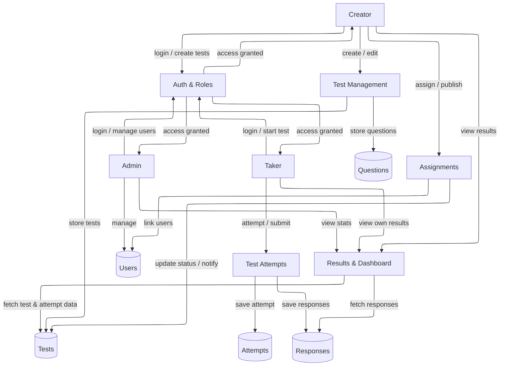

# Data Flow Diagram (DFD)

The Data Flow Diagram illustrates how data moves within the **SkillCheck – Enclosed Access Online Test Platform**. 
It represents the logical flow of information between the main actors (**Admin**, **Test Creator**, and **Test Taker**) and the system processes. 
All actions ultimately interact with a single centralized **database**, which stores user, test, assignment, and result data. 

