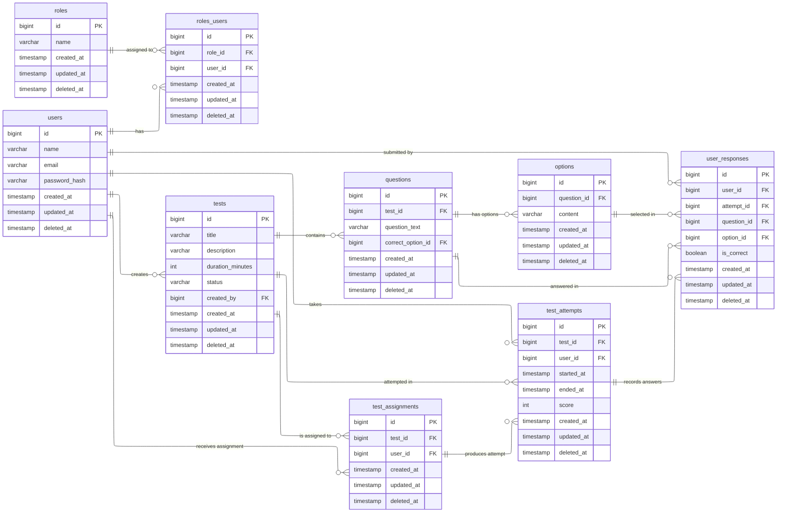

# ERD — skillcheck (normalized)

This diagram shows the normalized schema for SkillCheck (roles, users, tests, questions, options, assignments, attempts, and user responses). 
PK / FK annotations are included for clarity. 

