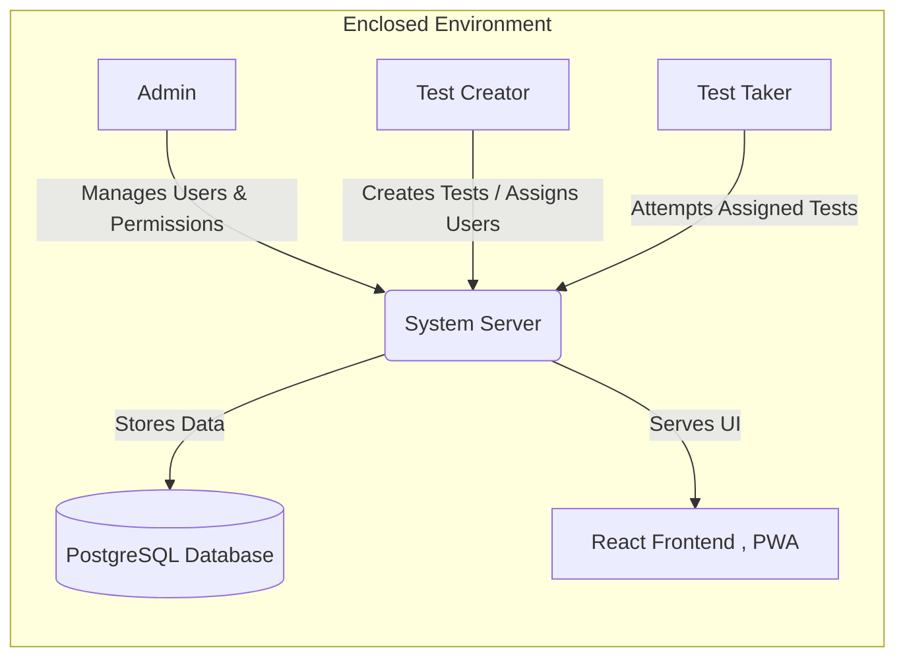

# Functional Specification Document  
**Project:** SkillCheck – Enclosed Access Online Test Platform (MVP)

---

## 1. System Overview

**Frontend:** React + PWA  
**Backend:** Node.js + Express   
**Database:** PostgreSQL   
**Authentication:** JWT-based authentication for Admin and Test Creators; password-based login for Test Takers   
**Deployment:** Public cloud environment   
**Access Model:** No public sign-up; all users managed by Admin 

---

## 2. Roles and Permissions

### 2.1 Admin
- Create users  
- Edit or deactivate users  
- Grant or revoke Test Creator permissions  
- View all tests and results

### 2.2 Test Creator
- Create, edit, and delete tests  
- Add and manage test questions  
- Assign users to take tests  
- Publish tests to Active state  
- View results of their tests

### 2.3 Test Taker
- Log in securely  
- View only assigned tests  
- Attempt tests once (unless reset)  
- Submit responses before time expires

---

## 3. Functional Requirements

### **FR1 – Authentication and Authorization (UC1, UC2)**
**Description:**  
Admin, Creator, and Test Taker must log in securely to access system features.  

**Functional Steps:** 
1. Admin and Creator log in using email and password.  
2. Test Taker logs in with assigned credentials.  
3. System issues JWT tokens for Admins and Creators.  
4. Role-based access ensures proper permission levels.  

**Acceptance Criteria:** Unauthorized access redirects to an “Access Denied” message.

---

### **FR2 – User Management (UC1 – Manage Users)**
**Description:**  
Admins manage all user accounts and roles.  

**Functional Steps:** 
1. Admin can create new users.  
2. Admin can edit or deactivate existing users.  
3. Admin can assign or revoke roles.  
4. Inactive users cannot log in.  

**Acceptance Criteria:** All changes should reflect instantly across the platform.

---

### **FR3 – Grant Creator Access (UC2 – Grant Creator Access)**
**Description:**  
Admin can promote or revoke user access to “Test Creator.”  

**Functional Steps:** 
1. Admin selects user from the list.  
2. Grants or removes “Creator” role.  
3. Saves updates to the user profile.  

**Acceptance Criteria:** Role updates become active on next login session.

---

### **FR4 – Test Creation (UC3 – Create Test)**
**Description:**  
Creators can design and define test properties.  

**Functional Steps:** 
1. Creator clicks “Create Test.”  
2. Fills title, duration, and description.  
3. Saves test in Draft state.  

**Acceptance Criteria:**  
A test cannot be saved without a valid title and duration.

---

### **FR5 – Question Management (UC4 – Add / Edit Questions)**
**Description:**  
Creators manage test questions before publishing.  

**Functional Steps:** 
1. Add new questions to a test.  
2. Each question includes text, 2–4 options, and a correct answer.  
3. Modify or delete questions for Draft tests.  
4. Save changes to the database.  

**Acceptance Criteria:**  
A test cannot be published without at least one valid question.

---

### **FR6 – Assign Users to Tests (UC5 – Assign Test Takers)**
**Description:**  
Creators assign registered users to their tests.  

**Functional Steps:** 
1. Creator opens “Assign Users.”  
2. Selects users from list.  
3. Confirms and saves assignment.  

**Acceptance Criteria:**  
Assigned users should see the test in their dashboard immediately after activation.

---

### **FR7 – Publish Test (UC6 – Publish Test)**
**Description:**  
Creators publish tests after adding questions and assigning users.  

**Functional Steps:** 
1. Creator selects a Draft test.  
2. Clicks “Publish.”  
3. System validates structure and updates test status to Active.  

**Acceptance Criteria:**  
Test becomes visible only to assigned Test Takers.

---

### **FR8 – Attempt Test (UC9, UC10 – View / Attempt Test)**
**Description:**  
Test Takers can start, attempt, and submit assigned tests.  

**Functional Steps:** 
1. Test Taker views assigned active tests.  
2. Clicks “Start Test.”  
3. Timer begins.  
4. System auto-saves progress as user answers questions.  
5. Only one attempt allowed unless reset by Creator.  

**Acceptance Criteria:**  
Timer persists through refresh; users cannot restart a completed test.

---

### **FR9 – Submit Test (UC11 – Submit Test)**
**Description:**  
System handles test submission and scoring logic.  

**Functional Steps:** 
1. User clicks “Submit” or system auto-submits when timer expires.  
2. Server validates and saves answers.  
3. System calculates and stores score in Attempts table.  

**Acceptance Criteria:**  
Submission status must update to “Completed” without duplication.

---

### **FR10 – View Results (UC7 – View Results by Test)**
**Description:**  
Creators can review test-level performance and export results.  

**Functional Steps:** 
1. Creator opens “Results.”  
2. Selects test and views all user attempts.  
3. Exports results in CSV format.  

**Acceptance Criteria:**  
Only completed attempts appear; exports must contain accurate data.

---

### **FR11 – View Results by User (UC12 – Admin / Creator)**
**Description:**  
Admin or Creator can view all tests attempted by a specific user.  

**Functional Steps:** 
1. Search for user in “Results by User.”  
2. System lists each test and score.  
3. Shows attempt timestamps and outcomes.  

**Acceptance Criteria:**  
All completed attempts should appear in the user’s record.

---

### **FR12 – Admin Dashboard (UC8 – System Overview)**
**Description:**  
Admins monitor overall system performance and statistics.  

**Functional Steps:** 
1. Admin opens Dashboard.  
2. System displays metrics like total users, tests, and attempts.  
3. Admin views analytics and performance trends.  

**Acceptance Criteria:**  
Dashboard refreshes dynamically and hides sensitive data.

---

### **FR13 – View Own Results (UC13 – Test Taker)**
**Description:**  
Test Takers can review their completed test results (Web or Mobile).  

**Functional Steps:** 
1. Test Taker logs in.  
2. Opens “My Results.”  
3. System fetches previous attempts and scores.  
4. Mobile version is read-only.  

**Acceptance Criteria:**  
Only logged-in user’s results should be visible.

---

## 4. Non-Functional Requirements
1. Security: Password hashing, JWT, HTTPS, and access control.  
2. Performance: Support for multiple simultaneous Test Takers.  
3. Reliability: Auto-save to prevent data loss.  
4. Usability: Simple dashboards for each role.  
5. Data integrity: Responses and scores stored consistently.  
6. Extensibility: Future proctoring features must integrate without major redesign.

---

## 5. Data Model Overview

### Users
- id  
- name  
- email  
- password_hash  
- role (admin, creator, taker)  
- is_active  

### Tests
- id  
- title  
- description  
- duration_minutes  
- status (draft, active, closed)  
- created_by  

### Questions
- id  
- test_id  
- question_text  
- options (JSON array)  
- correct_option_id  

### Test Assignments
- id  
- test_id  
- user_id  

### Attempts
- id  
- test_id  
- user_id  
- started_at  
- ended_at  
- responses (JSON)  
- score  

