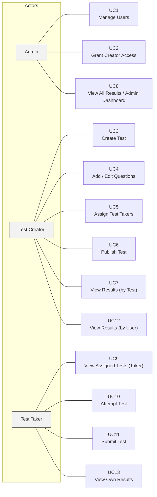

# Use Case Document  
**Project:** SkillCheck – Enclosed Access Online Test Platform (MVP)

---

## 1. Business Overview
SkillCheck is an enclosed-access online assessment platform designed for organizations that need to conduct secure, internal tests for employees, trainees, or members. Unlike open public testing systems, SkillCheck operates within a controlled environment where all users are pre-registered and access is managed tightly by an Admin.
Organizations often rely on manual or fragmented methods to conduct internal assessments, resulting in inconsistencies, administrative overhead, and lack of centralized tracking. SkillCheck solves these problems by offering a structured test creation, assignment, and execution workflow.

---

## 2. Actors / Roles

### 2.1 Admin
Responsible for managing platform users, assigning permissions, and overseeing tests and results.

### 2.2 Test Creator
Authorized user who can create tests, add questions, assign Test Takers, and view results.

### 2.3 Test Taker
End user who logs in to attempt tests assigned to them.

---

## 3. Preconditions
1. Test Takers must be registered users.
2. Test Creators must assign Test Takers before tests become visible to them.
3. Tests must contain at least one question before being published.

---

## 4. Use Cases

 
 

### **UC1 – Manage Users**
**Actor:** Admin  
**Preconditions:** Admin is logged in.  
**Main Flow:** 
1. Admin opens “User Management.” 
2. Adds, edits, or deletes user accounts. 
3. Updates user status (active/inactive). 
**Postcondition:** User data updated in database. 
**Exceptions:** Invalid details or duplicate email found.

---

### **UC2 – Grant Creator Access**
**Actor:** Admin  
**Preconditions:** Admin authenticated and user exists. 
**Main Flow:** 
1. Admin selects an existing user. 
2. Grants “Test Creator” access. 
3. Saves permission changes. 
**Postcondition:** User promoted to Creator role. 
**Exceptions:** User already has creator access.

---

### **UC3 – Create Test**
**Actor:** Test Creator  
**Preconditions:** Creator authenticated and has permissions. 
**Main Flow:** 
1. Creator logs in and clicks “Create Test.” 
2. Enters test title, duration, and description. 
3. Saves the test in Draft status. 
**Postcondition:** Test saved successfully in Draft state. 
**Exceptions:** Missing required input fields.

---

### **UC4 – Add / Edit Questions**
**Actor:** Test Creator  
**Preconditions:** Test exists in Draft state. 
**Main Flow:** 
1. Creator opens test in edit mode. 
2. Adds questions with text, options, and correct answers. 
3. Edits or deletes questions as needed. 
4. Saves changes. 
**Postcondition:** Questions successfully added or modified. 
**Exceptions:** Validation error – incomplete question data.

---

### **UC5 – Assign Test Takers**
**Actor:** Test Creator  
**Preconditions:** Test created and users available. 
**Main Flow:** 
1. Creator navigates to “Assign Users.” 
2. Selects users from system list. 
3. Assigns selected users to the test. 
4. Saves assignments. 
**Postcondition:** Test Takers linked to the test. 
**Exceptions:** No user selected or assignment failed.

---

### **UC6 – Publish Test**
**Actor:** Test Creator  
**Preconditions:** Test must have at least one question. 
**Main Flow:** 
1. Creator opens test from Drafts. 
2. Clicks “Publish.” 
3. System validates test data. 
**Postcondition:** Test published and visible to assigned users. 
**Exceptions:** No questions → Publish blocked.

---

### **UC7 – View Results (by Test)**
**Actor:** Test Creator  
**Preconditions:** At least one test attempt exists. 
**Main Flow:** 
1. Creator opens “Results.” 
2. Selects a test. 
3. Views all submissions and scores. 
4. Optionally exports results as CSV. 
**Postcondition:** Results displayed per test. 
**Exceptions:** No attempts found.

---

### **UC8 – View All Results / Admin Dashboard**
**Actor:** Admin  
**Preconditions:** Admin authenticated. 
**Main Flow:** 
1. Admin opens “Dashboard.” 
2. Views system-wide test data (users, tests, attempts). 
3. Analyzes performance metrics. 
**Postcondition:** Summary metrics displayed. 
**Exceptions:** Data unavailable or incomplete.

---

### **UC9 – View Assigned Tests**
**Actor:** Test Taker  
**Preconditions:** User has assigned tests. 
**Main Flow:** 
1. Test Taker logs in. 
2. Opens “Assigned Tests.” 
3. System lists all active tests. 
**Postcondition:** Assigned tests visible. 
**Exceptions:** No active tests.

---

### **UC10 – Attempt Test**
**Actor:** Test Taker  
**Preconditions:** Test assigned and Active. 
**Main Flow:** 
1. Test Taker clicks “Start Test.” 
2. Timer begins. 
3. Answers questions sequentially. 
4. System auto-saves progress. 
**Postcondition:** Attempt created and responses stored. 
**Exceptions:** Network disconnection or timeout.

---

### **UC11 – Submit Test**
**Actor:** Test Taker  
**Preconditions:** Attempt in progress. 
**Main Flow:** 
1. User clicks “Submit.” 
2. System validates answers and stops timer. 
3. Calculates score and saves record. 
**Postcondition:** Attempt marked “Completed.” 
**Exceptions:** Server error or timeout during submission.

---

### **UC12 – View Results (by User)**
**Actor:** Test Creator / Admin  
**Preconditions:** User has completed at least one test. 
**Main Flow:** 
1. Opens “Results by User.” 
2. Selects a specific user. 
3. System lists tests attempted and corresponding scores. 
**Postcondition:** User’s performance history displayed. 
**Exceptions:** User has no test attempts.

---

### **UC13 – View Own Results**
**Actor:** Test Taker (Web or Mobile App) 
**Preconditions:** Test Taker has completed at least one test. 
**Main Flow:** 
1. Logs in via web or mobile app. 
2. Opens “My Results.” 
3. System fetches completed attempts. 
4. Displays scores, test names, and completion dates. 
**Postcondition:** Results visible to logged-in user. 
**Exceptions:** No completed attempts found.

---

## 5. Future Scope Use Cases
1. Tab-switch and window-switch monitoring.
2. Camera and microphone requirements.
3. Face detection and cheating flagging.
4. Live proctoring dashboard.
5. Randomized question order per attempt.
